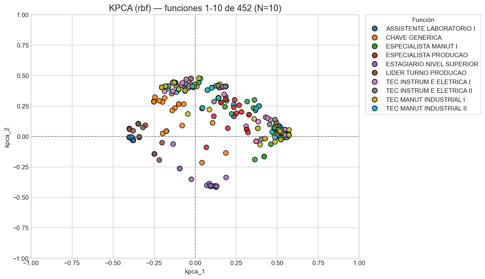

# Implementación de similitud entre trabajadores

Mejora de la implementación de similitud de vectores. El objetivo principal de este cambio es tener una solución más interpretable.

## Reducción de dimensionalidad

### Problemas solución anterior:

El problema principal de la solución anterior era su baja interpretabilidad. Esto se debía a la alta dimensionalidad de los datos, teniendo:

* 201 de Departamentos
* 402 de Funciones
* 354 de Roles

### Solución propuesta:

Realizar una reducción de dimensiones utilizando Kernel PCA (con kernel RBF) para solucionar el problema de alta dimensionalidad que generaban los múltiples valores de las variables categóricas.

### Resultados:

Se realizó la reducción de dimensionalidad de manera correcta. Para demostrar esto, se presenta un gráfico de los usuarios pertenecientes a las 10 funciones con mayor número de trabajadores.

## Cálculo de similitud

### Solución propuesta:

De igual manera que en la implementación anterior, se utilizó el método de *cosine similarity* para calcular la similitud entre usuarios, pero esta vez se hizo sobre los nuevos componentes generados.

### Resultados:

De igual forma que con la implementación pasada, se comprobaron los resultados utilizando las asignaciones realizadas por el equipo de Gestión de Accesos, con posterioridad a la fecha en la que se recibieron los datos base. En la siguiente tabla se pueden ver los resultados obtenidos por este método para distintos *thresholds*.

| Similarity threshold | Recall | Potenciales roles generados |
| :--- | :--- | :--- |
| 0.5 | 79.51 | 125336 |
| 0.6 | 77.90 | 106715 |
| 0.7 | 73.85 | 88421 |
| 0.8 | 71.16 | 66332 |
| 0.9 | 59.03 | 42147 |

Los resultados son similares a la implementación anterior, destacando nuevamente el umbral (threshold) de 0.8 como el punto de equilibrio óptimo, dada la relación entre el *recall* y el total de recomendaciones generadas en dicho intervalo.