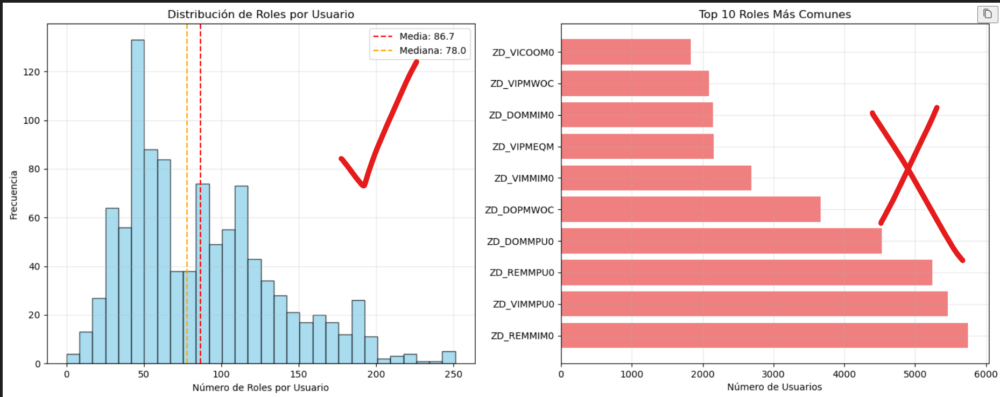

# Step3_comprehensive_analysis.ipynb

## 2

Grafico de numero de roles x usuario (el de la izquierda)

## 3

En una de esas mostrar solamente desde junio en adelante en los graficos? (asi como asignaciones desde que nos mandaron los datos)

Buenos graficos, tomar encuenta junio en adelente solamente (evolucion de datos)

Eliminar usuarios nuevos

## 4

Buenos graficos, creo que los de torta son una mejor representacion. Faltaria agregar en ese caso mostrar el numero de permisos que se refiere en otros

Colocar despues de 2

## 5

Grafico derecha descartado

Izquierda queda en veremos

## 6

Mostrar PCA o GRAFO en lugar de heatmap (pair_similarity.py)

## 7

Grafico izquierda, volver a hacer con resultados de simple_run.py