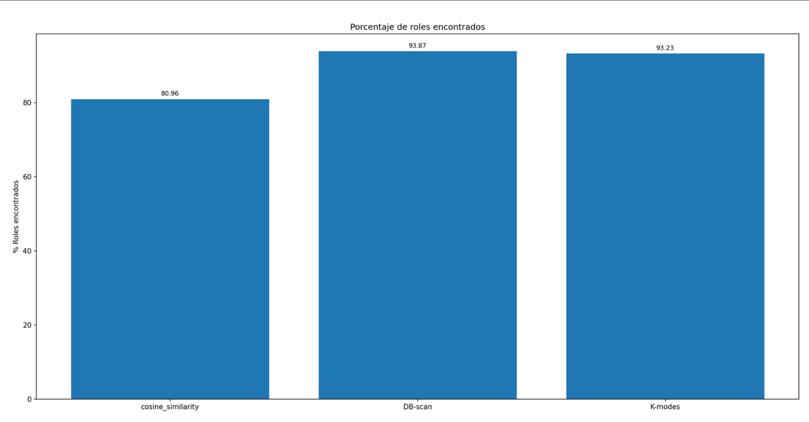

# Resultados de similitud entre usuarios

Resumen de los resultados obtenidos a partir de distintas pruebas realizadas con múltiples algoritmos.

Toda esta implementación fue realizada usando como base los vectores de usuario. En caso de querer ver el detalle de esa implementación, leer el archivo */data/user_vector.md*, el cual se encuentra disponible en el repositorio.

## Similitud básica

Se probaron algoritmos básicos de similitud entre vectores para poder determinar, de esta forma, la similitud entre distintos trabajadores. Los algoritmos que se probaron son:

- Cosine similarity
- Jaccard coefficient
- Dice

Estos tres algoritmos entregan valores entre 0 y 1, donde 0 significa totalmente distinto y 1 que son iguales.

### Verificación de resultados básicos

Para verificar los resultados, se le solicitó al equipo de gestión de accesos el historial de asignaciones que han realizado. Con este archivo, tenemos acceso a todas las asignaciones que han realizado desde el 2017 en adelante. Estas asignaciones vienen con el rol, nombre de usuario y fecha de asignación.

Dado que los datos iniciales que recibimos son del 01-06-2025 y los datos de las asignaciones son hasta el 03-09-2025, esto significaba que todas las asignaciones realizadas entre el 01-06-2025 y el 03-09-2025 no van a estar presentes en nuestros datos. Es por eso que vamos a utilizar esta información para verificar si los resultados obtenidos están bien o no.

Se realizaron distintas pruebas con los algoritmos anteriormente mencionados, probando distintos thresholds que determinaban el valor mínimo de similitud para considerar dos usuarios iguales. Los valores concretos probados son *0.7, 0.8 y 0.9*. A partir de los usuarios que se consideran similares, lo que se hace es simplemente comparar los permisos para así encontrar los permisos que le falten a un trabajador.

A partir de estos permisos faltantes encontrados, se compararon con los permisos asignados para verificar si la implementación por similitud era capaz de encontrar estas asignaciones realizadas.

En el siguiente gráfico se muestra la precisión y el recall obtenidos. Se van a tomar las asignaciones realizadas por el equipo de gestión de accesos como ground truth para obtener estas métricas.

El siguiente gráfico muestra la cantidad promedio de permisos recomendados y permisos asignados encontrados por usuario.

### Análisis

Como se puede ver en el primer gráfico, en general se obtiene una precisión muy baja pero un recall alto. Queda claro el porqué de este comportamiento al ver el segundo gráfico, en donde se puede apreciar que, en general, se encuentran demasiados candidatos por usuario, lo que genera que la precisión baje drásticamente.

En cuanto a los thresholds probados, el que da mejores resultados en general es 0.8. Esto se debe a que es el punto en donde disminuye drásticamente la cantidad promedio de potenciales permisos por usuario sin afectar tanto el promedio de asignaciones encontradas.

En cuanto al algoritmo, Dice y Cosine similarity dan resultados prácticamente idénticos. Para el caso de Jaccard coefficient, los resultados son notoriamente peores en comparación a los otros dos algoritmos.

## Similitud por clusters

En base a los resultados anteriores, se probó una implementación donde, en lugar de buscar usuarios similares basados en un threshold, se arman clusters en los grupos de usuarios para comparar los permisos con usuarios de un mismo cluster.

Se probaron implementaciones que encontramos en distintos papers, las cuales son:

- Una media entre el coeficiente de Jaccard y la distancia Hamming para estimar la similitud entre usuarios (implementación en *main/similarity_implementations/j_h.py*).
- DBSCAN (*main/similarity_implementations/db_scan.py*).
- K-modes (*main/similarity_implementations/k-modes.py*).

Para el caso de DBSCAN y K-modes, se hicieron pruebas utilizando de 3 a 10 clusters.

### Verificación de resultados

Se siguió el mismo procedimiento que con los algoritmos básicos.

Los resultados fueron comparados con los resultados de cosine_similarity con threshold de 0.8.

En los siguientes gráficos se muestran los resultados. Para el caso de DBSCAN y K-modes, se muestran únicamente los resultados con el número de clusters que presentan mejores resultados (en base a la relación Promedio permisos recomendados/Promedio asignaciones encontradas).

### Análisis

Como se puede apreciar en ambos gráficos, a pesar de que los resultados en cuanto a porcentaje de completitud de asignaciones encontradas de los métodos de clustering son altos, la cantidad de potenciales permisos encontrados es mucho mayor en comparación con cosine_similarity.

## TODO

- Probar con un mayor número de clusters el método K-modes.
- Empezar a realizar el clasificador de los potenciales permisos para que aprenda a diferenciar cuáles de todos esos permisos es útil recomendar.
  